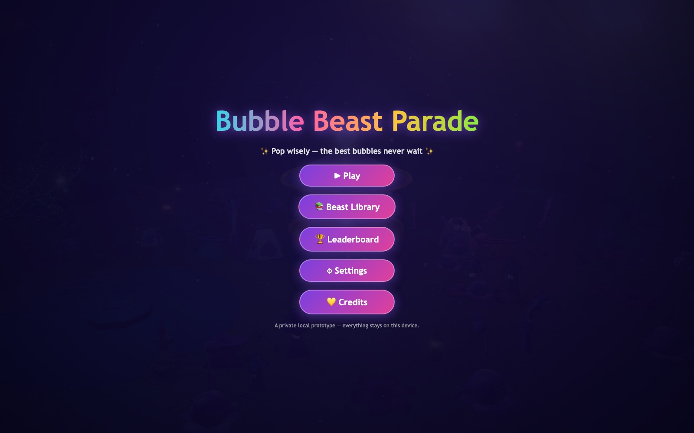
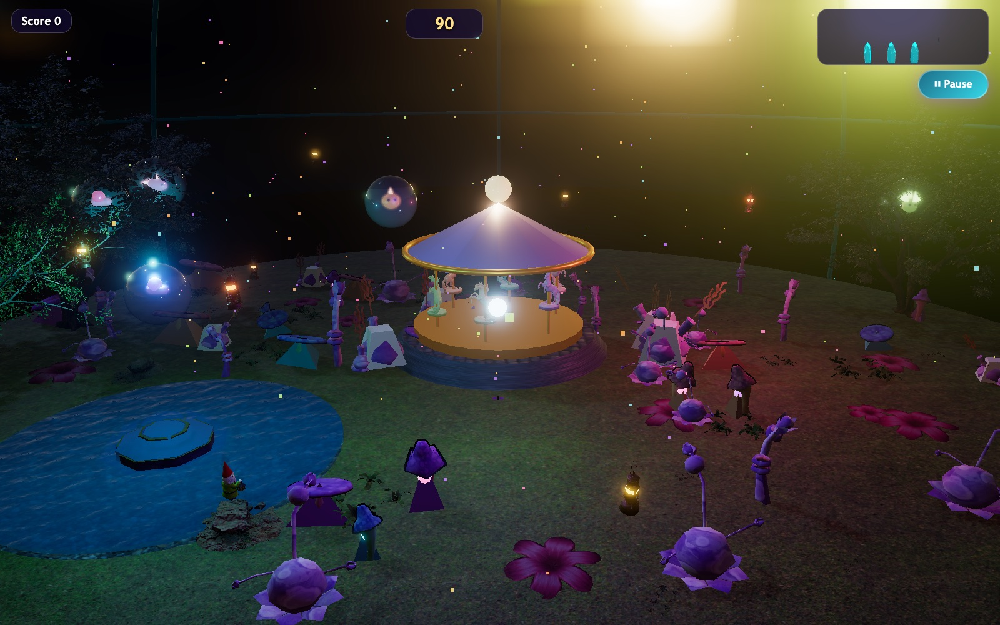
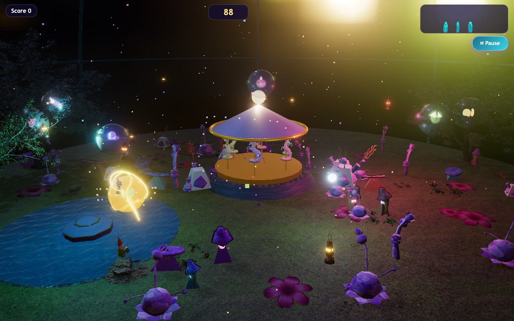
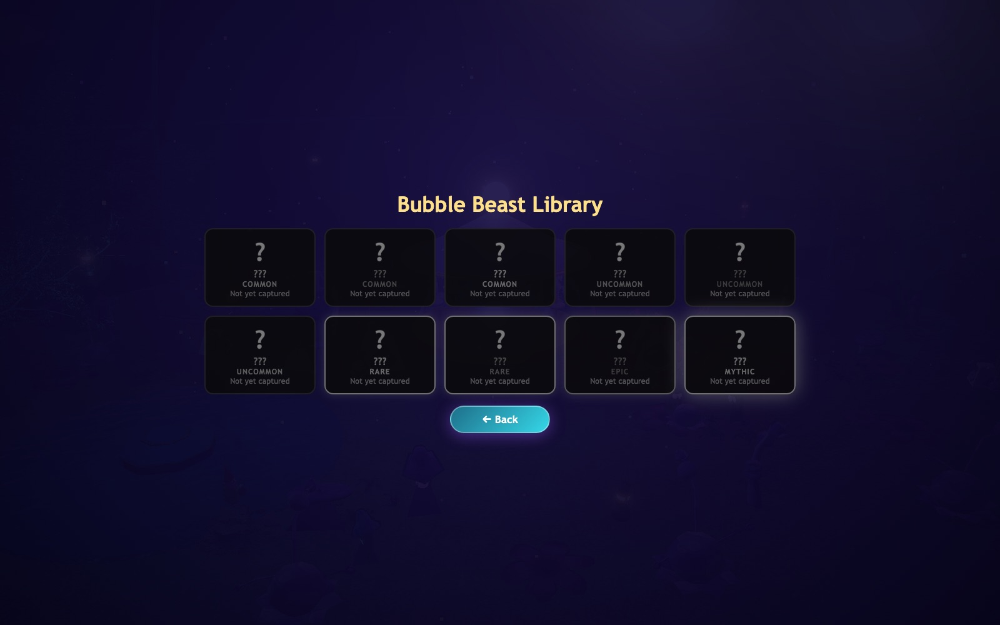
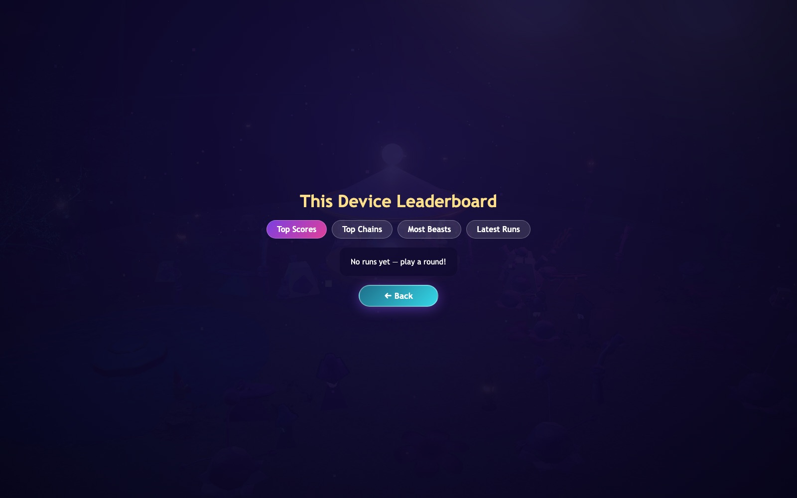
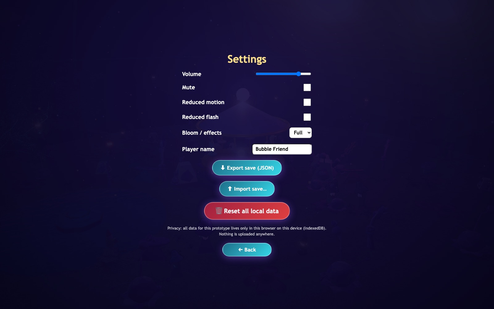

# Bubble Beast Parade 🫧

A complete, playable, browser-only 3D game: a magical bubble conservatory where
you pop bubbles with a wand to capture Bubble Beasts across 90-second
score-attack rounds. No backend, no accounts, no ads — everything runs and
saves locally in your browser.

<p align="center">
  
</p>

## Gameplay

<p align="center">
  
</p>

<p align="center">
  
</p>

- Move the pointer to steer the glowing wand; **click / tap** the highlighted
  bubble to pop it.
- Popping costs one **wand crystal** (3 max, one regenerates every 1.2 s) —
  crystals are deliberately scarce, so choose which bubbles deserve them.
- The most valuable bubbles (**Golden**, **Grand**) dissipate fastest; their
  shrinking shimmer ring shows the window closing. Popping them **refunds** the
  crystal — banking charges for them is the core skill.
- Same-colour pops build a **chain multiplier**; each chain pop rises one
  semitone, and perfectly-timed chain pops also refund a crystal.
- **Prism** bubbles trigger one of six disclosed events — exact odds are in the
  in-game Help (pause) screen.
- Captured beasts persist in the **Bubble Beast Library**; records go to the
  **This Device Leaderboard** (device-local only, by design).

## Beast Library & Leaderboard

<p align="center">
  
  
</p>

## Settings

<p align="center">
  
</p>

All data (settings, captures, runs, leaderboard) lives in this browser's
IndexedDB only. Settings offers JSON export/import, reduced-motion / reduced-flash
toggles, and a full local reset.

## Setup

```bash
npm install
npm run dev      # open http://localhost:5173
npm run build    # typecheck + production build into dist/
npm run preview  # serve the production build
```

## Browser requirements

- A desktop or mobile browser with **WebGL 2** (Chrome, Edge, Firefox, Safari 16+).
- Mouse **or** touch input.
- IndexedDB for saves (falls back to localStorage automatically).
- WebAssembly (for the Rapier physics engine).

## Project layout

```
src/
  audio/         WebAudio engine (synth pops, chain semitone ladder, music)
  data/          Design tables: bubbles, creatures, prism odds, colours
  entities/      Bubble pool + per-kind visuals
  input/         Pointer wand (raycast, hover ring, ribbon trail)
  persistence/   Typed IndexedDB wrapper, save export/import, leaderboard seam
  rendering/     Renderer/bloom context, procedural conservatory, creatures
  systems/       Game round controller, spawner paths, Rapier physics, pop VFX
  ui/            HUD + all screens (title/pause/results/library/board/settings/credits)
public/assets/   Downloaded assets + manifest.json (all optional at runtime)
```

Every external asset is listed in [ATTRIBUTIONS.md](ATTRIBUTIONS.md). Missing
assets always fall back to procedural geometry / synthesised audio, so the game
runs from a clean checkout with no extra downloads.

## Attribution & licensing

All third-party 3D models, HDRIs, and textures used are CC0 (public domain)
from [Poly Haven](https://polyhaven.com) and the Polygonal Mind CC0 pack, plus
MIT-licensed water-normal textures from the three.js examples repo. Every
asset, its source URL, and any modification made to it is listed in
[ATTRIBUTIONS.md](ATTRIBUTIONS.md). All creatures, garden decorations, the
greenhouse, the carousel, bubbles, particles, and UI art are procedural
originals generated in code. All sound is synthesised at runtime with the Web
Audio API — no external audio recordings are used.

Open-source libraries used: [Three.js](https://threejs.org) (MIT),
[Rapier3D](https://rapier.rs) (Apache-2.0), [Vite](https://vitejs.dev) (MIT),
[TypeScript](https://www.typescriptlang.org) (Apache-2.0).

## Data & privacy

All data (settings, captures, runs, leaderboard) lives in this browser's
IndexedDB only. Settings screen offers JSON export/import and a full reset.
